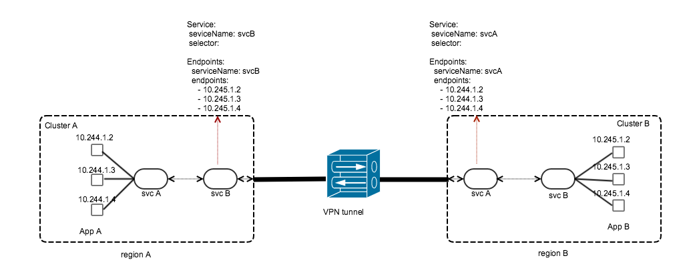

# k8s-endpoints-sync-controller

## Overview
This controller deployed on each connected kuberentes cluster replicates the kubernetes service and endpoints objects across clusters so that services can be discovered and communicate across clusters using kubernetes service names.

The communication across clusters relies on kube-proxy to update the iptable rules on each node as the controller creates/updates the api objects.

### Prerequisites

* All the clusters should have different clusterCIDR.
* All the clusters should be connected so that there is Pod to Pod connectivity across clusters. This can be achieved using 
    1) VPN across clusters with L3 routing if using Kubenet network plugin. 
    2) on GKE, https://istio.io/docs/examples/multicluster/gke/
    3) on IBM cloud, https://istio.io/docs/examples/multicluster/icp/ 
* Kubernetes API server of every cluster should be reachable to other clusters.

### Build & Run

1. Install go 1.9 or higher version
2. Install glide
3. checkout the project onto the GOPATH
4. run *glide up* -> to import all the dependencies
3. run *make build* -> to build the binary
4. run *make buildimage TAG=<image_name:version>* -> to build docker image

## Documentation

Having the pod IP addresses routable across clusters, the goal is to enable communication through K8s service objects i.e. App A in region A should talk to app B in region B using app B's K8s service name and vice-versa
This is achieved by creating in cluster A:
1. app B service object (headed/headless) without pod selectors 
2. endpoints object with endpoints as IP addresses of app B pods in cluster B. \

This enables kubeproxy in cluster A to load balance requests on the service name of app B to app B's pods.

### Annotations for Service Migration
The controller provides annotation features for the service teams to migrate services with no downtime. The following describes on how to use these annotation when migrating service from source cluster to target cluster. 

 **Annotation Key: vmware.com/syndicate-mode** \
 **Annoration Values: {source, receiver, singular}**

Before migration the service is replicated from source cluster to target cluster i.e the service obj in the source cluster will have the selector but the replicated service obj in the target cluster will not have selector and the endpoints obj in that cluster is maintained by the controller. After migration, the service is replicated from target cluster to source cluster.

##### Migrating K8s service obj with selector for stateful services
After deploying new pods in target cluster and completing the data migration, 
1. Add annotation 'receiver' in the source cluster. This should update the service obj in the target cluster with annotation 'source'. Also, the controller will remove the selector from the service in the source cluster and the replication will now happen from target→source cluster.
2. Update the service obj in the target cluster with right selector.

##### Migrating K8s service obj with selector for stateless services
After deploying new pods in target cluster, 
1. Add annotation 'union' in the source cluster. This will remove the selector from the service obj in source cluster and updates endpoints object in both clusters with union of pod ipaddresses( old ips + new ips). This ensures that the request for the service will be served by any of the pod in both clusters.
2. Update the service obj in target cluster with 'source' annotation. This should update the service obj in the source cluster with annotation 'receiver' and the replication will now happen from target→source cluster.
3. Update the service obj in the target cluster with right selector if needed.

##### Stop replicating K8s service & endpoints object
1. Update the service obj in any cluster with annotation 'singular'. This will stop replicating that service and will remove replicated svc obj and endpoints obj.
Creating service obj in any cluster with annotation 'singular' will also not create replicated objects. 

## Releases & Major Branches

## Contributing

The k8s-endpoints-sync-controller project team welcomes contributions from the community. If you wish to contribute code and you have not
signed our contributor license agreement (CLA), our bot will update the issue when you open a Pull Request. For any
questions about the CLA process, please refer to our [FAQ](https://cla.vmware.com/faq). For more detailed information,
refer to [CONTRIBUTING.md](CONTRIBUTING.md).

## License
